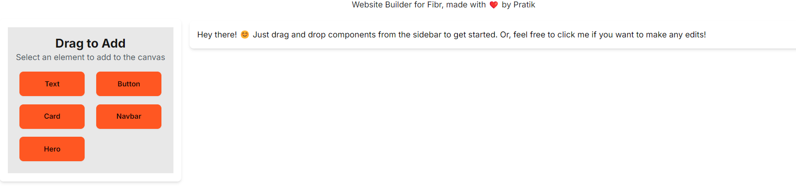
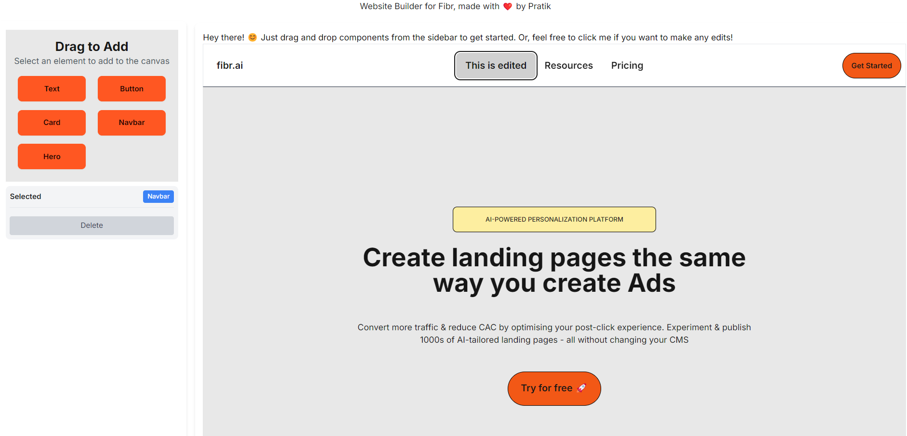
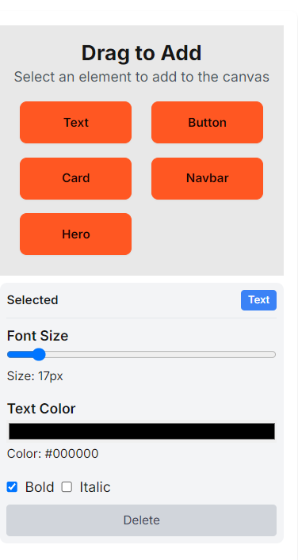

# Website Builder



## Table of Contents

- [Technologies Used](#technologies-used)
- [Features](#features)
- [Installation](#installation)
- [Usage](#usage)
- [Screenshots](#screenshots)

## Technologies Used

- **React**
- **Next.js**
- **TypeScript**
- **Tailwind CSS**
- **Daisy UI**: Tailwind CSS component library
- **Craft.js**: A React framework for building a drag-and-drop editor.
- **React ContentEditable**: A React component for editable content.

## Features

- **Drag-and-Drop Interface**: Easily add and rearrange components on your webpage.
- **Customizable Components**: Configure text, buttons, and cards with various styles.
- **Component Settings**: Adjust colors, sizes, and text styles using intuitive settings panels.

## Installation

To get started with the Website Builder, follow these steps:

1. **Clone the Repository**:

   ```bash
   git clone https://github.com/bhagatpratik07/fibr-website-builder
   cd website-builder
   ```

2. **Install Dependencies**:

   ```bash
   npm install
   ```

3. **Run the Development Server**:

   ```bash
   npm run dev
   ```

4. **Open Your Browser**:

   Navigate to `http://localhost:3000` to start using the Website Builder.

## Usage

Once the application is running, you can start designing your webpage using the following steps:

1. **Add Components**: Use the toolbox to drag and drop components like Text, Button, and Card onto your canvas.
2. **Customize Components**: Click on components to open the settings panel and adjust their properties..

## Screenshots

### Editor Interface



### Component Settings



Made with ❤️ by [Pratik Bhagat](https://pratikbhagat.vercel.app)
